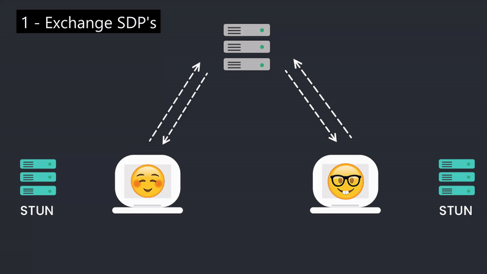

# WebRTC with .NET
- WebRTC (Web Real-Time Communication) is a technology that enables Web applications and sites to capture and optionally stream audio and/or video media, as well as to exchange arbitrary data between browsers without requiring an intermediary.
- It finds a **peer to peer path** to exchange video and audio in an efficient and low latency manner

## Signaling
- WebRTC is used for the communication streams in the browser but also needs a mechanism to coordinate communication and to send control messages, a process known as signaling.
- Signaling is used for:
  - To initialize and close communication
  - Sharing the network configurations with the outside world (IP-Address, Port)
  - Reporting errors in the connection
  - The signaling method can be picked by the developer of their choice like web sockets, signalR, Rest APIs etc.

## STUN Server
- STUN (Session Traversal Utilities for NAT) is used to get the IP address of your computer
- It's basically used to tell the user about it’s public IP Address:Port/ public presence through NAT

## TURN Server
- TURN (Traversal Using Relays Around NAT) server functions as a relay in case the peer-to-peer connection fails.
- Meaning it just acts as a medium of communication between two devices (i.e. It’s not Peer-To-Peer anymore)

## ICE
- ICE (Interactive Connectivity Establishment) collects all available candidates (Local IP Addresses, Reflexive Addresses - STUN, Relayed Addresses -TURN)
- It’s Job is to basically collect all information (Like how communication etc is gonna be established) and store it in SDP
- All the collected addresses are then sent to remote peer via SDP

## SDP
- SDP (Session Description Protocol) is not actually a protocol but in fact it’s just a format that describes ICE candidates, networking options, media options, security options and other stuff for making the connection between peers

## Let's understand WebRTC signaling flow


- Firstly, the two peers will exchange SDP’s using some sort of signaling method.
- Each peer will then make a series of requests to a STUN server which will generate a list of ICE candidates to use.
- Once peer 1 gets these ICE candidates back from the STUN they will send them over to peer 2 and will let the network determine the best candidate to use. Peer 2 will do the same by requesting their ICE candidates and then sending them to peer 1.
- When these candidates are exchanged and an optimal path is discovered data can begin to flow between the two peers. 

### Example
1. A will create an SDP offer, set it as local description, and send it to the peer B
2. B will get the offer and set it as remote description
3. B creates an answer, sets it as local description and signals the answer (SDP) to the peer A
4. A sets the answer received from the peer B as remote description
5. Connection established, exchange the data

## WebSockets v/s WebRTC


 - - - -

# Get started with WebRTC with .NET MVC application
- Firstly, we will create an ASP.NET core MVC web application 
- Then we will make the SignalR hub for managing signaling between the peers, install the below nuget package and register the SignalR service to the DI.

```powershell
Install-Package Microsoft.AspNetCore.SignalR.Client
```

```csharp
builder.Services.AddSignalR();
```

- Afterward, add a SignalR hub. A hub is the central point in an ASP.NET Core application through which all SignalR communication is routed. Create a hub for your application by adding a class named ```ConnectionHub``` that inherits from ```Microsoft.AspNetCore.SignalR.Hub```

```csharp
using Microsoft.AspNetCore.SignalR;
using System.Text.Json;
using WebRTC.Helpers;

namespace WebRTC.Hubs;

/// <summary>
/// SignalR connection hub with different methods
/// </summary>
public class ConnectionHub : Hub
{
	/// <summary>
	/// Instance of room manager helper to manage list of rooms for application life cycle
	/// </summary>
	private static readonly RoomManager _roomManager = new();

	/// <summary>
	/// Deletes the room on client disconnected from signalR hub
	/// </summary>
	/// <param name="exception"></param>
	/// <returns></returns>
	public override Task OnDisconnectedAsync(Exception? exception)
	{
		_roomManager.DeleteRoom(Context.ConnectionId);

		// Notifies the updated room list
		_ = NotifyRoomInfoAsync(false);

		return base.OnDisconnectedAsync(exception);
	}

	/// <summary>
	/// Notifies the updated room list info to the connected clients
	/// </summary>
	/// <param name="notifyOnlyCaller"></param>
	/// <returns></returns>
	public async Task NotifyRoomInfoAsync(bool notifyOnlyCaller)
	{
		var listOfRooms = _roomManager
			.GetAllRooms()
			.Select(x => new
			{
				x.RoomId,
				x.Name,
				Button = "<button class='btn btn-outline-secondary'>Join a room</button>"
			}).ToList();

		var jsonData = JsonSerializer.Serialize(listOfRooms);

		if (notifyOnlyCaller)
		{
			await Clients.Caller.SendAsync("updateRoom", jsonData);
		}
		else
		{
			await Clients.All.SendAsync("updateRoom", jsonData);
		}
	}

	/// <summary>
	/// Leave the room by id
	/// </summary>
	/// <param name="roomId"></param>
	/// <returns></returns>
	public async Task LeaveRoom(string roomId)
	{
		await Clients.Group(roomId).SendAsync("bye");
	}

	/// <summary>
	/// Get room list info
	/// </summary>
	/// <returns></returns>
	public async Task GetRoomInfo()
	{
		await NotifyRoomInfoAsync(true);
	}

	/// <summary>
	/// Sends the message
	/// </summary>
	/// <param name="roomId"></param>
	/// <param name="message"></param>
	/// <returns></returns>
	public async Task SendMessage(string roomId, object message)
	{
		await Clients.OthersInGroup(roomId).SendAsync("message", message);
	}

	/// <summary>
	/// Joins the room
	/// </summary>
	/// <param name="roomId"></param>
	/// <returns></returns>
	public async Task Join(string roomId)
	{
		// Add the client to group (room id)
		await Groups.AddToGroupAsync(Context.ConnectionId, roomId);

		// Invoke joined method of the caller
		await Clients.Caller.SendAsync("joined", roomId);

		// Invoke ready method of all clients for this room id (whoever is connected in the room)
		await Clients.Group(roomId).SendAsync("ready");

		// Remove the room from room list so no other client can join.
		if (int.TryParse(roomId, out var id))
		{
			_roomManager.DeleteRoom(id);
			await NotifyRoomInfoAsync(false);
		}
	}

	/// <summary>
	/// Creates the room
	/// </summary>
	/// <param name="name"></param>
	/// <returns></returns>
	public async Task CreateRoom(string name)
	{
		var room = _roomManager.CreateRoom(Context.ConnectionId, name);
		if (room is not null)
		{
			// Add the client to group (room id)
			await Groups.AddToGroupAsync(Context.ConnectionId, room.RoomId);

			// Invoke created method of the caller
			await Clients.Caller.SendAsync("created", room.RoomId);

			// Notify the updated room info list
			await NotifyRoomInfoAsync(false);
		}
		else
		{
			await Clients.Caller.SendAsync("error", "error occurred when creating a new room.");
		}
	}
}
```

- After that register the hub to the middleware pipeline

```csharp
app.MapHub<ConnectionHub>(
	"/connectionHub", 
	options => options.Transports = HttpTransportType.WebSockets);
```

- Now we will invoke the hub methods or events from client side or server side. To use the hub from client side install or add signalr.js to the page.

- Add JavaScript to build and start a HubConnection.

```js
// Connection to SignalR hub
const connection = new signalR.HubConnectionBuilder()
	.withUrl("/connectionHub")
	.configureLogging(signalR.LogLevel.Information)
	.build();
```

- Add configurations for RTC peer connection.

```js
// Configurations for ICE servers
const configurations = {
	'iceServers': [{
		'urls': ['stun:stun.l.google.com:19302', 'stun:stun2.l.google.com:19302']
	}]
};

// RTC Peer connection with configurations
const peerConnection = new RTCPeerConnection(configurations);
```

- Then we will start the signalR connection and invoke ```GetRoomInfo``` method to get list of rooms

```js
// Initialize SignalR connection and setup events
const initializeSignalR = async () => {
	try {
		await connection.start();
		console.log("SignalR Connected.");

		// Get room info
		await connection.invoke("GetRoomInfo");

	} catch (err) {
		logError(err);

		// Retry again to initialize
		setTimeout(initializeSignalR, 5000);
	}
};
```

- When connection is ready, we will create **WebRTC peer connection**
```js
const createPeerConnection = async (isInitiator, config) => {
	if (isInitiator) {

		// Create the data channel
		dataChannel = await peerConnection.createDataChannel('sendDataChannel');
		onDataChannelCreated(dataChannel);

		// Create the offer for other peer
		const createdOffer = await peerConnection.createOffer();

		// Set the offer as local local description for me
		try {
			await peerConnection.setLocalDescription(createdOffer);
		} catch (err) {
			logError(err);
		}

	} else {
		peerConnection.ondatachannel = (event) => {
			// Set the data channel as created by Initiator or other peer
			dataChannel = event.channel;
			onDataChannelCreated(dataChannel);
		};
	}
};
```

1. If I am an initiator/ sender, First I will create data channel for example ```sendDataChannel```. Then I will create a offer for other peer and I will set this offer as my local description.
2. If I am not an initiator or I am receiver I will listen to ```ondatachannel``` event of WebRTC peer connection and use the received data channel.

- We will add a event listener for two important events of WebRTC peer connection called ```onicecandidate```, and ```ontrack```.
- ```onicecandidate``` will receive a list of ice candidates from the STUN server and send it to the other peer for connection establishment.
- ```ontrack``` will receive a tracks (audio/ video) from other peer and will add it to remoteVideo html element.

```js
// send ice candidates to the other peer
peerConnection.onicecandidate = async (event) => {
	if (!event.candidate) {
		await sendMessage(peerConnection.localDescription);
	}
};
```

```js
// Retrieves the track from remote and add to remote video section
peerConnection.ontrack = (event) => {
	remoteVideo.srcObject = event.streams[0];
};
```

- And lastly we will create one method for handling signalling flow between the two peers
```js
const signalingMessageCallback = async (message) => {
	try {
		if (message.type === 'offer') {

			// Set the offer send by other peer as remote description for me
			await peerConnection.setRemoteDescription(message);

			// Prepare the answer for other peer
			const createdAnswer = await peerConnection.createAnswer();

			// Set the answer prepared for other peer as local description for me
			await peerConnection.setLocalDescription(createdAnswer);

		} else if (message.type === 'answer') {

			// Set the answer send by other peer as remote description
			await peerConnection.setRemoteDescription(message);

		} else if (message.type === 'candidate') {
			await peerConnection.addIceCandidate(new RTCIceCandidate({
				candidate: message.candidate
			}));
		}
	} catch (err) {
		logError(err)
	}
};
```

1. Firstly, If it is an offer from other peer, we will add the offer as remote description. Then we will create an answer for other peer and we will set it's as a local description
2. If it is an answer from other peer, we will add it is as remote description
3. If it is an ice candidates, we will add it to the peer connection

- - - -

# Let's see the demo of the application
1. Let's create the room.


2. Let's open the app from other tab/ browser/ or device to connect to this peer via by joining the room.


3. In the Your connection status section, you will be able to see realtime connection updates.


4. In the videos section, after successful connection you will be able to make a video/ audio call with other peer.
